# TeensyMaestro Front Panel and PCB

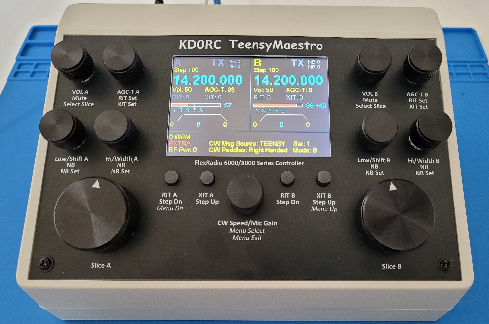

### Summary
The TeensyMaestro is a custom-built hardware controller first designed by Len (KD0RC) to interface with FlexRadio transceivers - specifically models in the 6000 and 8000 series. It performs some, but not all, of the common functions that the SmartSDR app or the Flex Maestro perform. The name TeensyMaestro comes from its core component: the Teensy 4.1 microcontroller, which powers the device. Len's initial version was built using point-to-point wiring which presents a challenge for builders. Len (KD0RC) and Simon (NV0E) have created a PCB and matching front panel that simplifies the build process. Len's documentation for hardware version 1, along with firmware that supports all versions, is available here:

[TeensyMaestro for Flex 6000 Radios](https://github.com/KD0RC/Teensy-Maestro-for-Flex-6000-radios)

The intent of this PCB is to simplify the build process, make it easier to produce a polished final product, and replace some components with less expensive alternatives.

### Main PCB

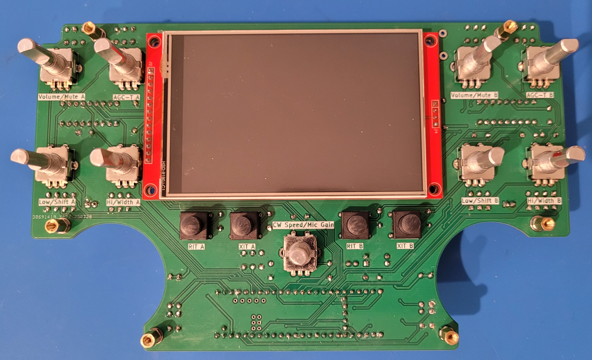

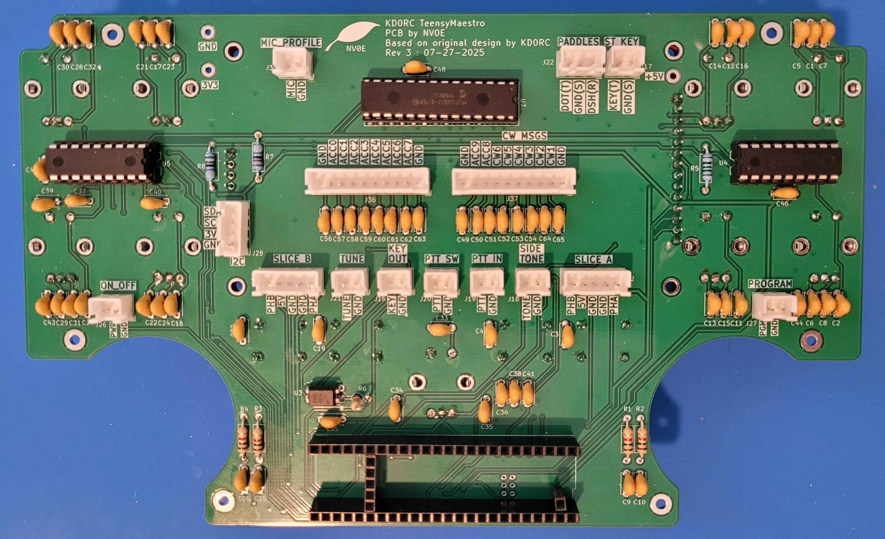

### Design Features
- A main PCB that simplifies building the Teensy Maestro and minimizes wiring errors.
- A front panel that matches the main PCB that can be fabricated by a PCB manufacturer in aluminum, with a black finish. This inexpensive option will allow a builder to achieve a refined, professional finish.
- Through-hole components to simplify assembly.
- PCB headers to connect to the rear panel connectors.
- I2C bus header for future extensibility.
- Optocoupler on key-out connector for electrical isolation from the radio.
- Reduced BOM cost due to part substitution.

### Schematic Design

[Schematic Design](https://github.com/rimuadmin/TeensyMaestro-Hardware/blob/main/TeensyMaestro%20Main%20PCB/TeensyMaestro%20Main%20PCB.pdf)

### Circuit Differences from Original Design
- **Multiplexers (CD74HC5067M) → I2C I/O Expanders (MCP23008/MCP23017)** - This frees up some GPIOs on the Teensy for other uses.
- **Adafruit LCD (HX8357D) & Touch Controller (TSC2007) → ST7796S LCD** - The new LCD has an integrated touch controller, reducing cost from ~$45 to ~$19. It's also slightly larger (4.0" vs. 3.5”) but retains the same 480x320 resolution.
- **Panel-Mounted Switches → PCB-Mounted Switches** - The 4 panel mounted switches (RIT-A, XIT-A, RIT-B, XIT-B) are now directly mounted on the PCB.
- **Panel-Mounted Encoders → PCB-Mounted Encoders** - The 9 rotary encoders are now directly mounted on the PCB.
- An optocoupler has been added to the KEY OUT for electrical isolation between the TeensyMaestro and the radio.

# Ordering the PCB & Front Panel from JLCPCB

> Ordering the Main PCB and Front Panel in the same order will save on shipping costs.

### Add the Main PCB to the cart
1. Download the zip file (TeensyMaestro Main PCB/production/TeensyMaestro Main PCB_3.0.zip) from this repository to your PC
2. Open JLCPCB's web page (jlcpcb.com) in your browser
3. Click 'Order Now'
4. Use the 'Add gerber file' button to select the zip file that you downloaded
5. The order page will import the gerber files and you should see the 2D representation of the front and rear of the panel displayed.
6. JLCPCB examines the zip file and sets the Layers and Dimensions values.
7. The default quantity is 5, which is the minimum order quantity.
8. The remaining defaults don't need to be changed, but if you prefer a different color PCB you could select it here.
9. Optionally, select 'Surface Finish: LeadFree HASL'
10. Click 'Save to Cart'.

### Add the Front Panel to the cart
1. Download the zip file (TeensyMaestro Front Panel/production/TeensyMaestro_Front_Panel_v2.0.zip) from this repository to your PC.
2. Open JLCPCB's web page (jlcpcb.com) in a browser
3. Click 'Order Now'
4. Use the 'Add gerber file' button to select the zip file that you downloaded
5. The order page will import the gerber files and you should see the 2D representation of the front and rear of the panel displayed.
6. JLCPCB examines the zip file and sets the Layers and Dimensions values.
7. Select 'Base Material: Aluminum'
8. The default quantity is 5, which is the minimum order quantity.
9. Select 'PCB Color: Black'
10. Optionally, select 'Surface Finish: LeadFree HASL'
11. Select 'Mark on PCB: Remove Mark' *(If you don't remove this, the fabricator will print the order number on the front panel)*
12. Click 'Save to Cart'.

Check out and purchase the two boards.

# PCB Assembly Steps

> *Do not solder the display on to the front side of the PCB until all the components on the rear side of the PCB have been soldered. The display covers over component through-holes that can't be soldered after the display is in place.*

- The slice tuning encoders are attached directly to the front panel, with openings in the main PCB to allow the encoders to pass through.
- The front side of the PCB holds the display, encoders and push buttons.
- The reverse side of the PCB holds the Teensy 4.1 micro controller, I/O Expanders, header connectors, resistors and capacitors.

### 1. Prepare the Display

#### 1a. Remove the SD Card Holder from the Display
To fit all the necessary through-hole components onto the TeensyMaestro PCB, we had to fully utilize the available board space. One key adjustment involves removing the SD card holder that's built into the display module. There were several reasons for this:
- The SD card holder is not connected to the TeensyMaestro circuit, so it serves no functional purpose. 
- The metal casing of the SD card holder can short against the leads of through-hole components on the back of the PCB. 
- If left in place, it can cause the display to tilt or sit unevenly, making it difficult to mount the front panel flush.

**Steps to Remove the SD Card Holder:**
1. **Apply Flux** - Dab a small amount of flux on the joints to improve heat transfer and help the solder flow into the braid.
2. **Add Solder to the Joints** - Reflow the existing joints by adding a small amount of fresh solder to each one.
3. **Use Solder Wick** - Use solder wick to absorb the molten solder from each joint.
4. **Remove the Metal Cover** - While heating the corner joints with a soldering iron, gently pry up the metal cover of the SD card holder using tweezers. Don't apply excessive force or the solder pads will lift off the FR4 PCB material.
5. **Detach the Plastic Connector** - With the cover off, continue heating the pins while using tweezers to lift the plastic connector. 
6. **Clean the Area** - Use isopropyl alcohol and Q-tips to clean off any remaining flux or residue from the PCB.

#### 1b. Solder 4 Pin Header to Display
This 4-pin header is not used by the circuit, but must be added to provide mechanical support for the display on the PCB.

1. Count and mark a 4-pin section of a header strip.
2. Cut cleanly between the 4th and 5th pins.
3. Smooth edges with a file or sanding block if sharp or uneven.
4. Solder the 4 pin header to the left side of the display.
5. The pin headers on each side should now be the same height.

In this picture, the SD Card holder has been removed and the 4 pin header soldered to the left side of the display PCB:

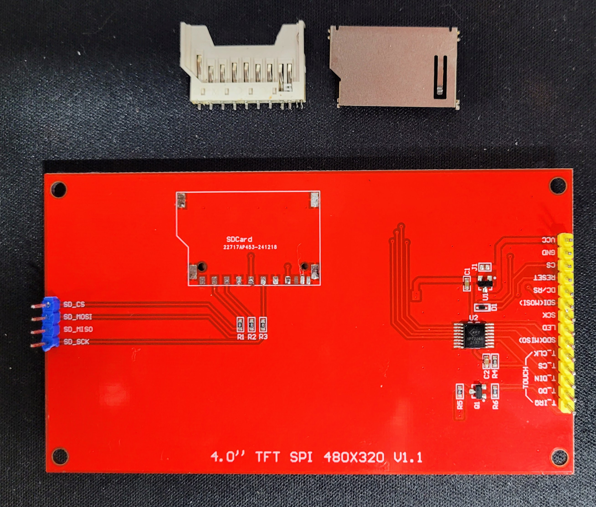

### 2. Solder Male Headers to the Teensy 4.1

#### 2a. Prepare Two 24-Pin Headers for the Long Sides
1. Count and mark two 24-pin sections on a header strip.
2. Cut cleanly between the 24th and 25th pins.
3. Smooth edges with a file or sanding block if sharp or uneven.
4. Repeat for the second 24-pin header.

#### 2b. Create a 5-Pin Header for GND, PROG, and ON/OFF Pins
1. Count and cut a 5-pin section.
2. Check alignment: These 5 pins go on the short side of the Teensy, opposite the USB connector (above the SD card slot area).
3. Clean up the cut edge if needed.

#### 2c. Create a 1-Pin Header for VUSB
1. Cut a single pin from the strip.
2. Use pliers to gently remove any excess plastic or bent pins.

#### 2d. Solder Male Headers to the Teensy 4.1

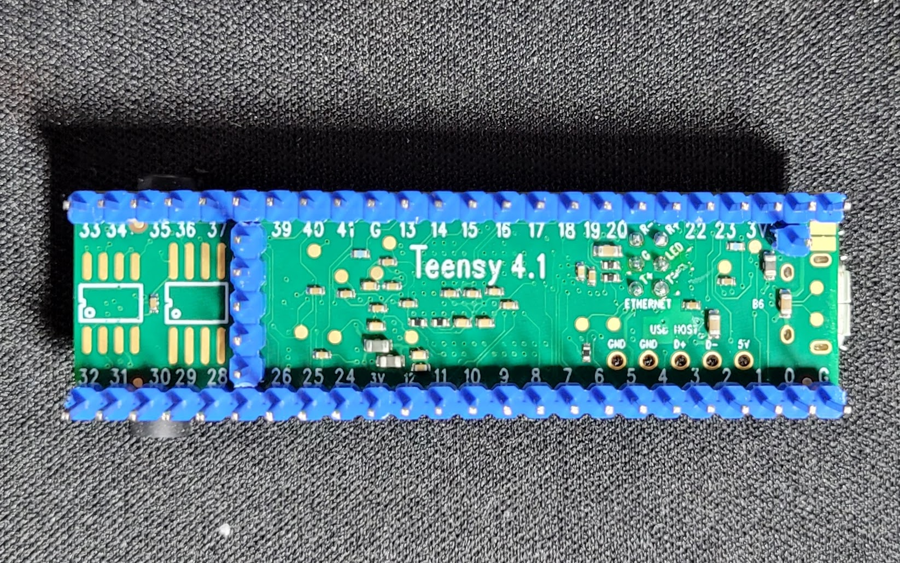

### 3. Prepare Female Headers for the Teensy 4.1

#### 3a. Cut Two 24-Pin Female Headers
1. Count 25 pins on a header strip.
2. Cut on the 25th pin using side cutters. This preserves 24 usable sockets in the segment before the cut.
3. Trim plastic burrs from the cut end using a file or sandpaper if needed.
4. Repeat to create a second 24-pin female header.
5. Dry fit both on the long edges of the Teensy to verify alignment.

#### 3b. Cut a 5-Pin Header for GND, PROG, ON/OFF
1. Count 6 pins and cut on the 6th pin—this gives you a 5-socket segment.
2. Inspect and clean the edges to ensure all 5 sockets are usable.
3. This header will align with the 5-pin row near the SD card slot, opposite the USB port.

#### 3c. Cut a 1-Pin Header for VUSB
1. Cut on the 2nd pin to create a single-socket header.
2. Be gentle—cutting near the ends can sometimes crack or distort the housing.
3. Clean it up and confirm the pin is straight and usable.

### 4. Solder Female Headers to the PCB
1. Insert all female headers into your PCB in the correct locations.
2. Plug the Teensy into the headers (without soldering yet) to align everything flat and square.
3. Solder the headers to the PCB while the Teensy holds them in place. This helps prevent misalignment.
4. Once all headers are secure, remove the Teensy and finish your solder joints if needed.

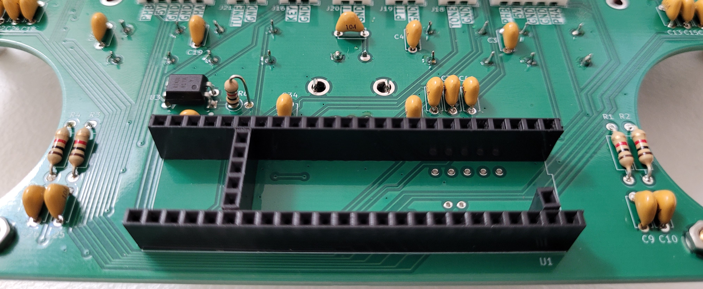

### 5. Rear Side
1. Solder 2 x 18-pin IC sockets to the PCB. Check that the socket alignment matches the PCB footprint.
2. Solder 1 x 28-pin IC socket to the PCB. Check that the socket alignment matches the PCB footprint. Depending on the length of the socket leads, trim the leads to reduce the chance of the leads touching the back of the display.
3. Solder the opto-isolator to the PCB. Check the alignment to ensure the opto-isolator is oriented correctly.
4. Solder capacitors to the PCB.
5. Solder resistors to the PCB.
6. Solder header connectors to the PCB.

> *The 4 holes for the I2C expansion header are right next to the 4 pins for the display. Be careful to use the correct holes for the I2C connector.*

7. Carefully check all solder connections. The display will cover some components and you will not have another chance to correct some solder joints.

### 6. Front Side
1. Solder the encoders to the PCB.
2. Solder push button switches to the PCB.

### 7. Display
- *Check all rear side components have been mounted before this step.*
- Solder display to PCB. Be careful that the header pins are all evenly seated on the PCB. 

> The 4 left side pins are only required for mechanical support of the display on the PCB. If you prefer, only solder one of the four pins. If the display needs to be desoldered, there are 3 less pins to desolder.

### 8. Standoffs
- The standoffs are recommended to prevent the front panel from bowing when the small encoders are tightened against the PCB. 
- The front panel needs to be kept approx. 8mm from the main board. This height can be obtained by combining a 6mm standoff, a nut and a washer.
- Before placing the standoff, screw a nut onto the thread followed by a washer. Then insert the combined standoff, nut and washer through the mounting holes from the front of the PCB and screw another nut on the rear of the PCB to hold it in place.
- Repeat for all 6 mounting holes.
- The other ends of the standoffs will not be attached to the front panel, but this will provide enough mechanical support to prevent the panel from bowing.

Standoff measurements:

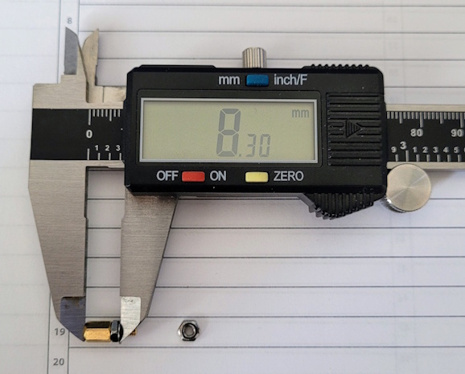

The front of the PCB should look like this:

### 9. ICs
- Insert 2 x MCP23008 I/O Expanders into 18-pin sockets. Check that the chip alignment matches the PCB footprint and socket alignment.
- Insert 1 x MCP23017 I/O Expander into 28-pin socket. Check that the chip alignment matches the PCB footprint and socket alignment.
- Insert Teensy 4.1 into socket.

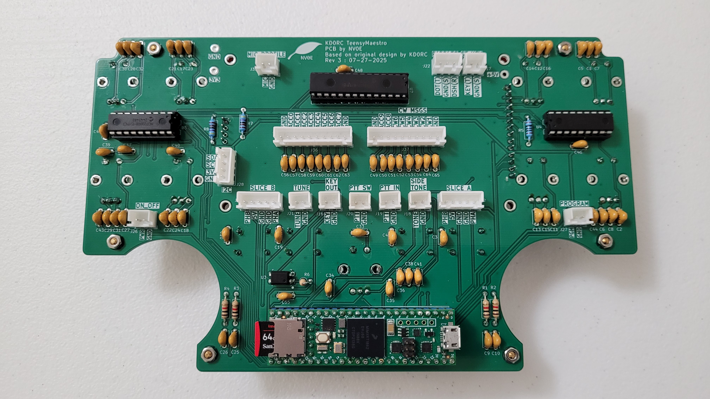

### 10. PCB Bring-Up Steps
- Visually inspect PCB for obvious defects like shorts, bad solder joints, broken traces, or mis-placed components.
- Use a multi-meter to measure conductivity between 5v, 3.3v and GND test points to make sure there are no shorts.
- Apply power to the PCB via the Teensy 4.1 USB connector.
- Use a multi-meter to measure 5v and 3.3v voltages on PCB.
- If firmware is not already loaded on the Teensy 4.1 then install the latest firmware that supports the v2 hardware.
- Restart the device.
- Check LCD displays the startup screen and subsequent screens.

# Front Panel and Enclosure Mounting

This section covers recommendations, tips and techniques that I (NV0E) used for building my TeensyMaestro. You may find other ways of wiring the connectors, or have other preferences for the rear panel of the enclosure. The following describes a set of parts and techniques that work to create a successful project. Hopefully this will help with whatever choices you make. Since I was testing multiple revisions of the PCB and determining which parts work best, one of my goals was to make it fairly easy to disconnect the PCB from the enclosure if I needed to. I didn't want to have to desolder anything to take it apart.

You'll see in the picture below, I haven't added switches for all the header connectors, most notably the CW message buttons are not yet mounted.

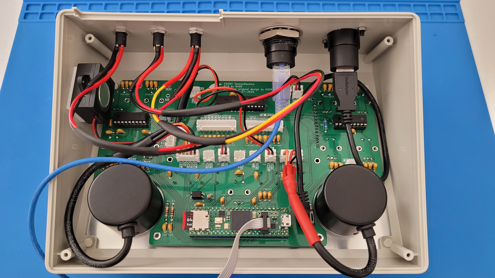

## Wiring Header Connectors

### Headers
There are a large number of headers on the reverse side of the board for connections to elsewhere inside the TeensyMaestro. There are some headers that must be connected (SLICE A and SLICE B), but the remainder are optional. If you use CW, you will want to wire KEY OUT, PADDLES and/or ST KEY to rear connectors and CW MSGS to momentary switches elsewhere in the enclosure. 

The PCB is designed to hold JST-XH sockets for the headers. These are readily available in pre-wired packs from Amazon. If another connector type is preferred, these could be substituted with any 2.54mm pitch socket.

| Header      | Purpose |
| :---------- | :---------------------------------- |
| SLICE A     | A 5-pin connector for 5V, GND, Phase A, GND and Phase B that connects to the large encoder on the left side. |
| SLICE B     | A 5-pin connector for 5V, GND, Phase A, GND and Phase B that connects to the large encoder on the right side. |
| TUNE        | A 2-pin connector for a Tune switch mounted in the enclosure. |
| KEY OUT     | A 2-pin connector for a rear-panel connector for CW Key output. This output uses an opto-coupler for electrical isolation. |
| PTT SW      | A 2-pin connector that can optionally be connected to a momentary contact push-to-talk switch that can be mounted in the enclosure. |
| PTT IN      | A 2-pin connector that can optionally be connected to a rear-panel connector for a foot-switch. |
| SIDE TONE   | A 2-pin connector for a speaker or side-tone amplifier and speaker. |
| ST KEY      | A 2-pin connector for a rear-panel connector for a CW straight key. |
| PADDLES     | A 3-pin connector for DOT (Tip), GND (Shield), DASH (Ring), which connect to a rear-panel connector for CW paddles. |
| I2C         | A 4-pin connector for SDA, SCL, GND, 3.3V that can be used for future expansion of the I2C bus to another internal PCB. |
| ON_OFF      | A 2-pin connector for a momentary contact switch to turn the TeensyMaestro on or off. |
| PROGRAM     | A 2-pin connector for a momentary contact switch to put the Teensy 4.1 into programming mode. |
| MIC_PROFILE | A 2-pin connector that can be connected to a 3PDT switch for switching between two mics and two Flex mic profiles. |
| CW_MSGS, ACC8, ACC9 | A 10-pin connector for connection to GND and 6 CW message playback buttons mounted in the enclosure. Two additional accessory pins are included for future use. |
| ACC0 - ACC7   | A 10-pin connector for GND and 8 accessory pins for future use. |

## Rear Panel Connectors

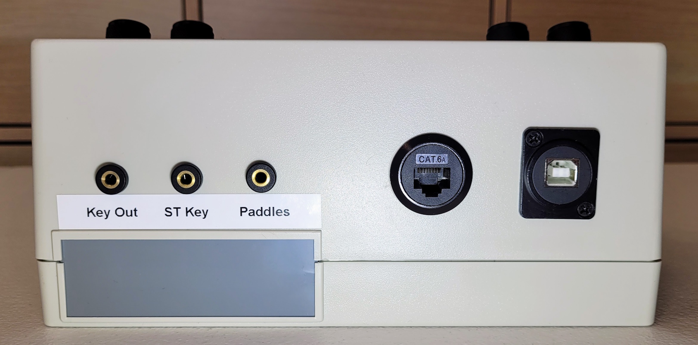

For DIY makers, using circular connectors helps make a good looking enclosure. It's much easier to drill a perfectly round hole than it is to cut a perfect square. Using a Step Bit allows you to drill large sized holes. Here's a step bit that is large enough for the rear panel connectors listed below: https://www.amazon.com/dp/B076QC5BWR

### Internal USB Cable
The TeensyMaestro must be powered via a USB cable connected to the Teensy 4.1. There is not a lot of room between the Slice A encoder and the Teensy 4.1, but using a USB cable with 90 degree left angle connector solves this issue. https://www.amazon.com/dp/B003YKX6W2

### USB Panel Mount Connector
I chose to have a USB Type-B connector on the rear panel as they are robust connectors. This is often just referred to as a printer cable. A rear connector that has USB Type-A on the inside (matches the internal USB cable) and USB Type-B on the outside: https://www.amazon.com/dp/B0CVX68HCH

### Internal Ethernet Patch Cable
A short (1ft or less) SlimRun ethernet patch cable can be used to connect to the Teensy 4.1's RJ45. These SlimRun cables are easier to work with in tight spaces: https://www.monoprice.com/product?p_id=15133

### Ethernet RJ45 Panel Mount Connector
This circular connector is easy to mount in the back panel of the enclosure: https://www.amazon.com/dp/B09WM84YRF

### Rear Panel Jacks
If needed, there are several headers that can be connected to jacks on the rear panel: Paddles, ST Key, Key Out, PTT In. I used these jacks: https://www.amazon.com/dp/B0C9MDDLNG

The Key Out is polarized - make sure that the GND wire connects to the shield of the panel jack.

### Straight Key Connector Jack

The Straight Key (ST_KEY) input is marked on the PCB with KEY(T), GND(S). These describe the parts of the jack: T=Tip, S=Shield

| Purpose | 3.5mm Jack | JST-XH Header Connector Wire | Pin Number |
| ------- | ---------- | ---------------------------- | :--------: |
| --      | Ring       | --                           |     --     |
| GND     | Sleeve     | Black                        |     1      |
| KEY     | Tip        | Red                          |     2      |

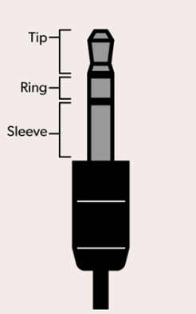

### Paddle Connector Jack

The paddle connector needs to be wired correctly to work. See the chart below for the pinout and wiring colors. The PCB is marked with DOT(T), GND(S), DSH(R). These describe the parts of the jack: T=Tip, S=Shield, R=Ring

| Purpose | 3.5mm Jack | JST-XH Header Connector Wire | Pin Number |
| ------- | ---------- | ---------------------------- | :--------: |
| DASH    | Ring       | Red                          |     1      |
| GND     | Sleeve     | Black                        |     2      |
| DOT     | Tip        | Yellow                       |     3      |

## Internal Connections

### Mini Speaker for Sidetone
This mini speaker can be connected to the side tone header connector, and then use double sided tape to stick it to the inside wall of the enclosure: https://www.amazon.com/dp/B07FTB281F

### Slice Encoder Connections
The large slice encoders have long leads attached that make cable management inside the enclosure difficult. I trimmed the length of the leads, soldered the XH connector wires and covered the connections with heatshink tubing. See the chart below for the header pin outs and wire color mapping.

| Purpose | Encoder Wire | JST-XH Header Connector Wire | Pin Number |
| ------- | ------------ | ---------------------------- | :--------: |
| Phase A | Green        | Black                        |     1      |
| GND     | Shield       | Red                          |     2      |
| GND     | Black        | White                        |     3      |
| +5V     | Red          | Yellow                       |     4      |
| Phase B | White        | Orange                       |     5      |

## Mounting the Front Panel

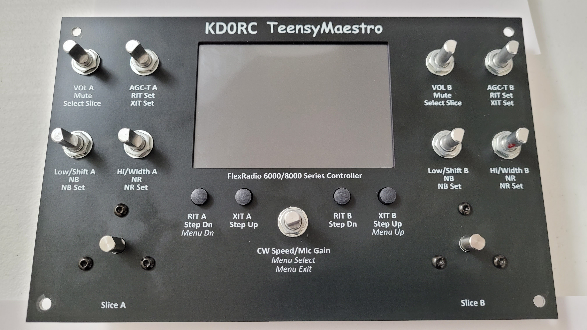

The enclosure listed in the BOM includes a front panel that will not be used. Instead use the aluminum front panel included in this project and was ordered with the PCB.

The front panel is only colored black on the front side. All of the edges are bare aluminum. Use a black permanent magic marker to color the inside edge of the display opening, the button holes and the outside edge of the panel. This will produce a better look than leaving the raw aluminum showing. Be careful not to get magic marker on the front of the panel as it will be noticeable.

If you use black screws on the front panel you will end up with a much nicer looking TeensyMaestro. If you prefer, you could counter sink the screws. This will expose raw aluminum, so don't forget to use the black magic marker to color the counter sunk holes.

### Small Encoders
The nine small encoders are each shipped with a washer and nut. While the 8mm spacers help a lot to prevent the front panel from bowing, adding extra nuts under the front panel on each encoder will help even further. Without them, the panel can warp and compress the display when you tighten the panel nuts on the top.

1. Place panel nuts on each encoder and screw them down far enough that with the front panel in place, the nuts don't touch it.
2. Now place the panel on the controls so that it rests on the spacers and put washers and nuts on the controls. Only tighten them enough to hold the panel with no slack (i.e. just touching).
3. Next, use a small screwdriver to turn the bottom nuts until they just touch the panel.
4. Finally, tighten the top nuts hand-tight and you are done.

If you elect to build without the additional panel nuts, be careful not to tighten the panel down very much. More than finger-tight will be too much.

### Large Slice Encoders
To attach the two large slice encoders, you will need a total of 6 x 3mm diameter x 12mm long screws. I used these: https://www.amazon.com/dp/B0CLLC3G3S 

### Enclosure Screws
You will need 4 screws to attach the panel to the enclosure. Black sheet metal screws with either a button head or truss head will work well.

### Knobs
If you are using the recommended aluminum knobs, you may prefer to wrap the nine small encoder shafts with adhesive aluminum tape to improve the fit of the knobs.

# Bill of Materials

### Main PCB
| Item                                        | Qty   | URL                                                                                            |
| :------------------------------------------ | ----: | :----------------------------------------------------------------------------------------------|
| Teensy 4.1                                  |   1   | https://www.digikey.com/en/products/detail/sparkfun-electronics/16771/12180099                 |
| Teensy 4.1 Ethernet kit                     |   1   | https://www.digikey.com/en/products/detail/sparkfun-electronics/18615/15775140                 |
| MCP23008 I/O Expander                       |   2   | https://www.digikey.com/en/products/detail/microchip-technology/MCP23008-E-P/735951            |
| MCP23017 I/O Expander                       |   1   | https://www.digikey.com/en/products/detail/microchip-technology/mcp23017-e-sp/894272           |
| LTV-817 Optoisolator                        |   1   | https://www.digikey.com/en/products/detail/liteon/LTV-817/385836                               |
| 100nF THT MMC Capacitors                    |   63  | Buy one pack: https://www.amazon.com/dp/B08B3VCK42                                             |
| 1K Resistors                                |   5   |                                                                                                |
| 4K7 Resistors                               |   2   |                                                                                                |
| 100R Resistors                              |   1   |                                                                                                |
| 4.0in 480x320 TFT Touch Screen LCD          |   1   | https://www.amazon.com/dp/B0CKRJ81B5?ref=ppx_yo2ov_dt_b_fed_asin_title&th=1                    |
| Enclosure                                   |   1   | The same enclosure is available from either Amazon or Digikey: <ul><li>https://www.amazon.com/dp/B005T58ZTO</li><li>https://www.digikey.com/en/products/detail/bud-industries/pc-11491/439698</li></ul>This enclosure comes with a front panel that will be replaced by the front panel in this project. |
| Slice Tuning Knobs	                      |   2   | https://www.amazon.com/dp/B09CDNKMKD                                                           |
| Rotary Encoder 600 PPR                      |   2   | https://www.amazon.com/dp/B01MZ4V1XP                                                           |
| Bourns Rotary Encoder 20 PPR 6mm x 20mm     |   9   | https://www.digikey.com/en/products/detail/bourns-inc/PEC11L-4120F-S0020/4699171               |
| Additional M7 x 0.75mm nuts for encoders    |   9   | Buy one pack of https://www.amazon.com/dp/B0CN2JCNFY                                           |
| MEC Switches 3ETH9 Pushbutton 12mm          |   4   | https://www.digikey.com/en/products/detail/mec-switches/3ETH9-12-0/5253118                     |
| Black Aluminum 6mm shaft, 17mm wide knobs   |   9   | Buy two packs of https://www.amazon.com/dp/B07TXYBB7Z							     	       |
| <ul><li>9 x 2-pin JST-XH Headers</li><li>1 x 3-pin JST-XH Headers</li><li>1 x 4-pin JST-XH Headers</li><li>2 x 5-pin JST-XH Headers</li><li>2 x 8-pin JST-XH Headers</li></ul>                |   15   | Buy one pack containing multiple sizes: https://www.amazon.com/gp/product/B0DS2GHWRS/ref=sw_img_1?smid=A3S807LE0L63AP&th=1             |
| 40 Pin 2.54mm Single Row Male Header        |   1   | Buy one pack containing 30 pieces & cut pieces to length: https://www.amazon.com/dp/B0F2FL972R |
| 40 Pin 2.54mm Single Row Female PCB Header  |   1   | Buy one pack containing 60 pieces & cut pieces to length: https://www.amazon.com/dp/B07CGGSDWF |
| DIP IC Socket 18 pin                        |   2   |  |
| DIP IC Socket 28 pin                        |   1   |  | 
| M2.5 x 6mm + 6mm brass hex spacer standoffs |   6   | https://www.amazon.com/dp/B08F2F96HM                                                           |
| M2.5 Head Machine Screws Nuts Washers       |   1   | https://www.amazon.com/dp/B07CLQFQ4C                                                           | 

### Alternative PCB Parts
| Item                                        | Qty   | URL                                                                                            |
| :------------------------------------------ | ----: | :----------------------------------------------------------------------------------------------|
| CL170844FR 6mm D-shaft Knob - Grey          |   9   | These have a line on the top and side, so may not be suitable for the Teensy Maestro, but they are available in multiple colors and fit well. This link is for the grey color option: https://www.digikey.com/en/products/detail/cliff-electronic-components-ltd/CL170844FR/19559125 |
| 2-pin JST-XH Headers and wires              |   9   | These have a longer (50cm) and heavier (22AWG) wire. If you are frequently opening the enclosure, these are more robust and easier to work with. https://www.amazon.com/dp/B0BW9VGY7D  |
| 3-pin JST-XH Headers and wires              |   1   | These have a longer (50cm) and heavier (22AWG) wire. If you are frequently opening the enclosure, these are more robust and easier to work with. https://www.amazon.com/dp/B0BW9VGY7D  |
| Slice Tuning Knobs                          |   2   | These have an arrow on the top side but they work. https://www.amazon.com/dp/B07TY32628       |

### Enclosure Mounting Parts
The maker has a lot of flexibility in how the PCB is wired internally and what connectors to use. You may find it more economical to purchase the screws at a hardware store than buy the packs listed below. These are what I used:
| Item                                        | Qty   | URL                                          |
| :------------------------------------------ | ----: | :------------------------------------------- |
| Short USB 90deg left cable                  |   1   | https://www.amazon.com/dp/B003YKX6W2         |
| USB Type A to Type B Panel Mount Connector  |   1   | https://www.amazon.com/dp/B0CVX68HCH         |
| RJ45 Panel Mount Connector                  |   1   | https://www.amazon.com/dp/B09WM84YRF         |
| SlimRun Ethernet patch cable                |   1   | https://www.monoprice.com/product?p_id=15133 |
| Mini Speaker                                |   1   | https://www.amazon.com/dp/B07FTB281F         |
| 3.5mm Jack socket                           |   1   | https://www.amazon.com/dp/B0C9MDDLNG         |
| Black Sheet Metal Screws				      |   4   | |
| Black Button Head Socket Cap M3 Screws      |   6   | https://www.amazon.com/dp/B0CLLC3G3S         |

### Tools
| Item                                       | Qty   | URL                                          |
| :----------------------------------------- | ----: | :------------------------------------------- |
| Step Drill Bit                             |   1   | https://www.amazon.com/dp/B076QC5BWR         |

# 3D Views

### Front panel

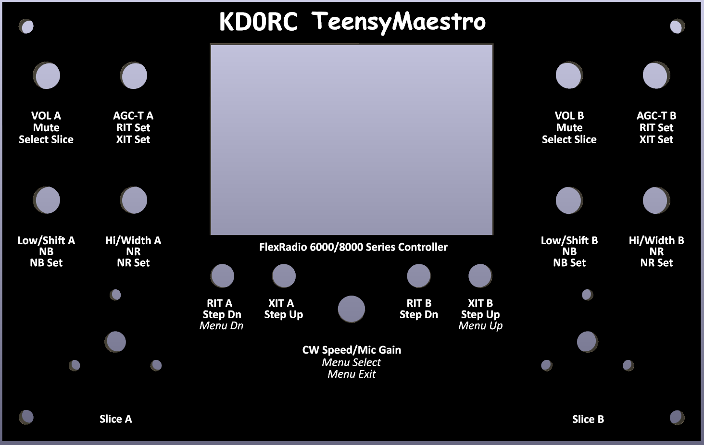

### Main PCB Front

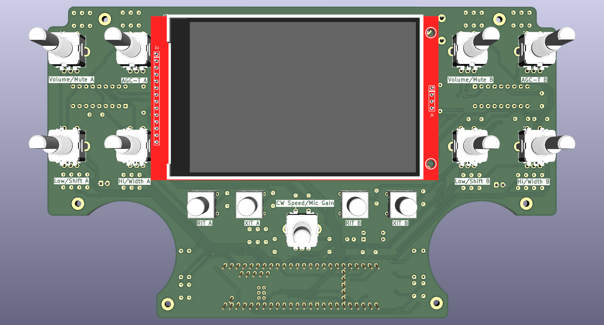

## Main PCB Rear

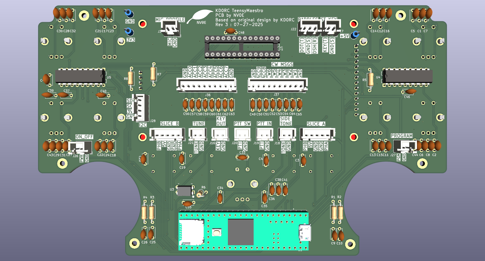
