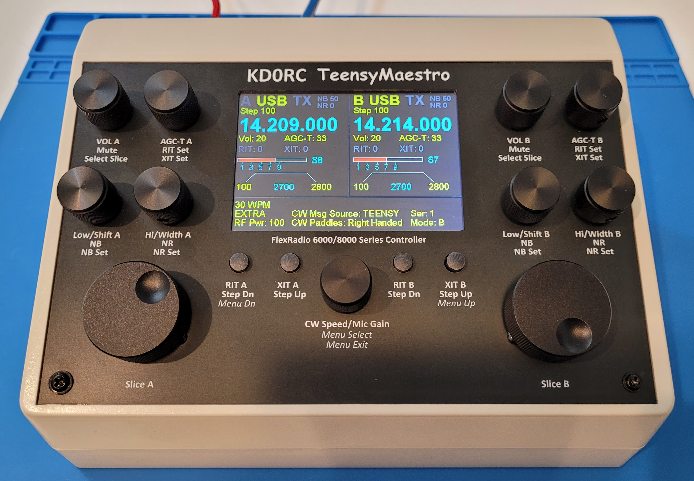

# TeensyMaestro Front Panel and PCB

### What Is TeensyMaestro?
The TeensyMaestro is a custom-built hardware controller first designed by Len (KD0RC) to interface with FlexRadio transceivers - specifically models in the 6000 and 8000 series. It performs some, but not all, of the common functions that the SmartSDR app or the Flex Maestro perform. The name TeensyMaestro comes from its core component: the Teensy 4.1 microcontroller, which powers the device. Len's initial version was built using point-to-point wiring which presented a challenge for builders. Len (KD0RC) and Simon (NV0E) have created a PCB and matching front panel that simplifies the build process. 

### What Is This Project?
This repository describes the version 2 PCB and Front Panel hardware. The intent of this PCB is to simplify the build process, make it easier to produce a polished final product, and replace some components with less expensive alternatives. It has detailed instructions that describe how to order parts, build and assemble a TeensyMaestro using the version 2 hardware.

The documentation for building the PCB and Front panel is here: 

[TeensyMaestro Hardware Wiki](https://github.com/rimuadmin/TeensyMaestro-Hardware/wiki)

Len's firmware that supports all versions is available here:

[TeensyMaestro for Flex 6000 Radios](https://github.com/KD0RC/Teensy-Maestro-for-Flex-6000-radios)

Len's GitHub page has a detailed user manual that explains how to operate the TeensyMaestro and build instructions for version 1.
