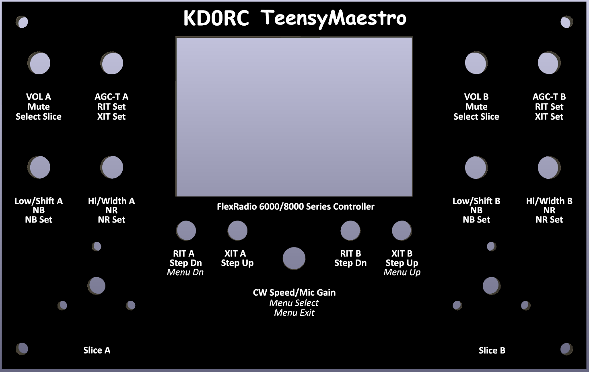

# PCB Front Panel for the TeensyMaestro

## Summary
- This front panel design has holes and openings that align with the accompanying [TeensyMaestro PCB](https://github.com/rimuadmin/Teensy_Maestro-hw) that holds the encoders, switches and display.

## TeensyMaestro
The PCB described in this repository supports the following project from KD0RC:

[TeensyMaestro for Flex 6000 Radios](https://github.com/KD0RC/Teensy-Maestro-for-Flex-6000-radios)

## Associated Projects
- [TeensyMaestro Main PCB](https://github.com/rimuadmin/TeensyMaestro-Hardware)
- [TeensyMaestro for Flex 6000 Radios (the firmware)](https://github.com/KD0RC/Teensy-Maestro-for-Flex-6000-radios)

## 3D View

## Ordering from JLCPCB
- Because this is designed to be fabricated in aluminum, it is a single sided board. 
- It does not have copper layers because it's a front panel.

> Order the PCB and Front Panel in the same order to save on shipping costs.

1. Download the zip file (production/TeensyMaestro_Front_Panel_v2.0.zip) from this repository to your PC.
2. Open JLCPCB's web page (jlcpcb.com) in a browser
3. Click 'Order Now'
4. Use the 'Add gerber file' button to select the zip file that you downloaded
5. The order page will import the gerber files and you should see the 2D representation of the front and rear of the panel displayed.
6. Select 'Base Material: Aluminum'
7. Select 'PCB Qty'. The minimum quantity is 5.
8. Select 'PCB Color: Black'
9. Optionally, select 'Surface Finish: LeadFree HASL'
10. Select 'Mark on PCB: Remove Mark' *(If you don't remove this, the fabricator will print the order number on the front panel)*
11. Click 'Save to Cart'.

